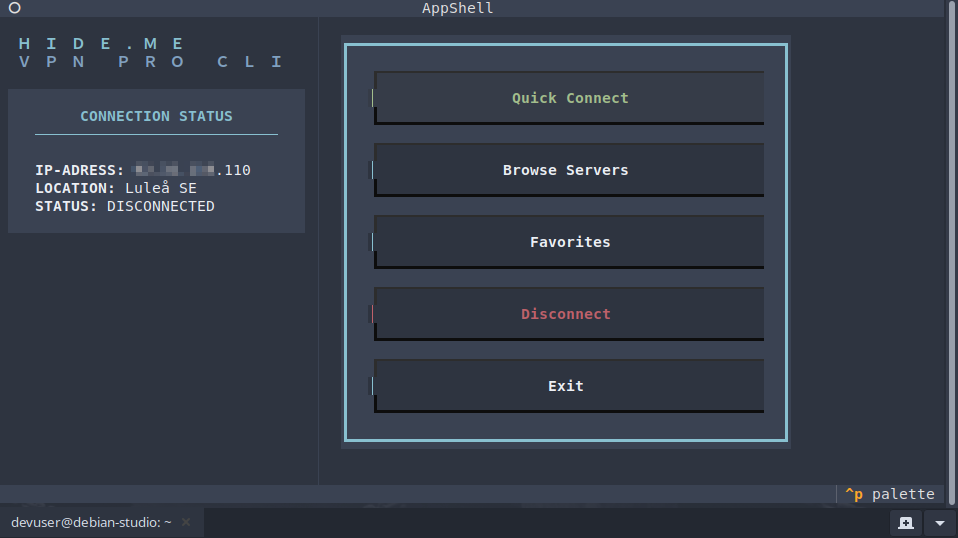
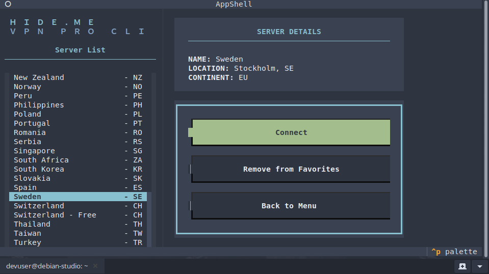
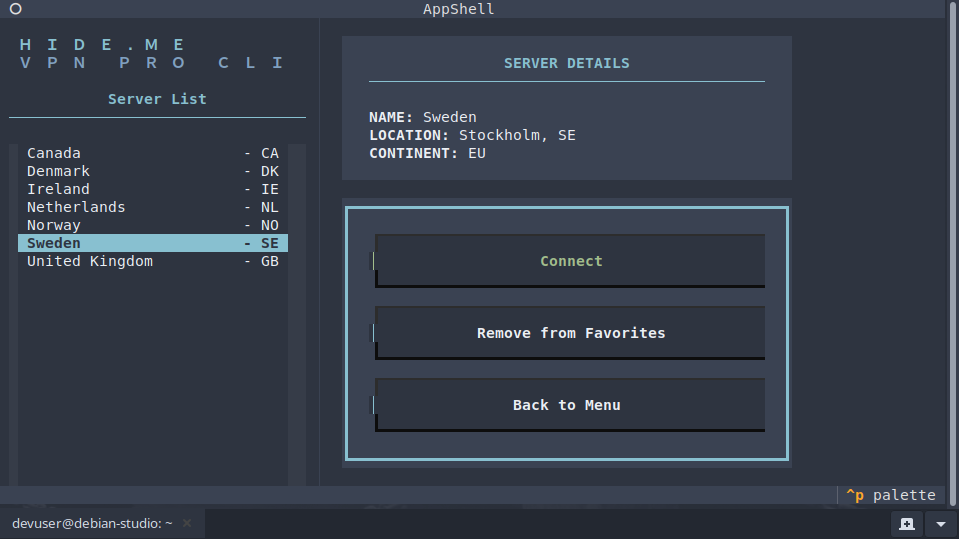

# Hide.me VPN CLI Pro (v2)

A robust and sleek Terminal User Interface (TUI) client for Hide.me VPN on Linux, built with Python and Textual. The project focuses on asynchronous performance, systemd integration, and a clean, "Nordic" aesthetic.

## ⚠️ Project Status: Work in Progress

This project is currently under active development and is considered an **Alpha release**. It is not yet feature-complete and is intended for testing and development purposes. Use at your own risk.

### Planned Enhancements & Roadmap
There are several areas where the project is currently being improved:

* **API Handling:** The current implementation does not correctly parse "nested servers" within the API responses, which limits the number of visible nodes.
* **Source Documentation:** Improving docstring coverage and type-hinting to meet professional Python standards.
* **Architectural Refinement:** Ongoing work to further decouple domain logic from infrastructure (Schema/Model separation).
* **Functionality Expansion:** Implementation of **Port Forwarding**, **Open Port** testing, and expanded user settings.
* **Stability:** General bug fixing and stabilising asynchronous workers to prevent race conditions.

## Showcase

<p align="center">
  
  
</p>
<p align="center">
  
</p>

## Features

* **Modern TUI:** Built using `Textual` for a responsive terminal experience.
* **Systemd Integration:** Manages VPN connections as system services via `pystemd`.
* **Asynchronous Architecture:** Non-blocking network requests and system commands.
* **Favourite Management:** Save frequently used servers locally for rapid access.
* **Real-time IP Verification:** Automatic connection status monitoring and IP leak protection.

## Architecture

The project is organised into distinct layers:
* **Core:** Domain models, schemas (DTOs), and interface definitions.
* **Services:** VPN provider logic, network monitoring, and systemd interaction.
* **TUI:** Presentation layer (controllers, screens, and custom widgets).
* **Utils:** Standardised logging and HTTP communication.

## Installation

### Prerequisites
* **Python 3.10+**
* **Systemd** (Linux-based OS)
* **hide.me CLI (by eventure):** This TUI acts as a wrapper for the eventure implementation. Ensure the CLI is installed and functional on your system.

### Setup
Detailed instructions for cloning the repository, setting up the virtual environment, and adding the script to your system's PATH are available in the dedicated **[INSTALL.md](INSTALL.md)** file.

## Usage

To launch the application, run:
```bash
python src/main.py